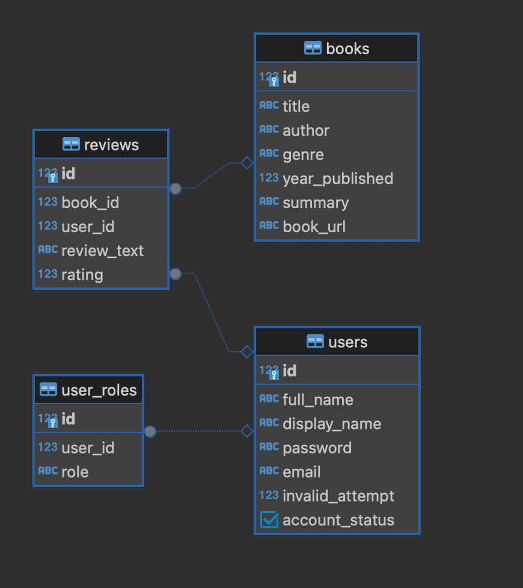

# Database Schema

## Overview
This document outlines the database schema and relationships for the Book Review System project. The database consists of tables for users, books, reviews, and user roles.

## Schema

### Users Table
| Column          | Type    | Description                               |
|-----------------|---------|-------------------------------------------|
| `id`            | Integer | Primary key, unique identifier for a user |
| `full_name`     | String  | Full name of the user                     |
| `display_name`  | String  | Display name visible in the system        |
| `password`      | String  | Hashed password for user authentication   |
| `email`         | String  | Unique email address of the user          |
| `invalid_attempt`| Integer | Number of failed login attempts          |
| `account_status`| Boolean | Status of the user account (active/inactive) |

### Books Table
| Column          | Type    | Description                               |
|-----------------|---------|-------------------------------------------|
| `id`            | Integer | Primary key, unique identifier for a book |
| `title`         | String  | Title of the book                         |
| `author`        | String  | Author of the book                        |
| `genre`         | String  | Genre of the book                         |
| `year_published`| Integer | Year the book was published               |
| `summary`       | String  | Short summary of the book                 |
| `book_url`      | String  | URL to the book's image or resource       |

### Reviews Table
| Column          | Type    | Description                               |
|-----------------|---------|-------------------------------------------|
| `id`            | Integer | Primary key, unique identifier for a review|
| `book_id`       | Integer | Foreign key referencing the book's ID     |
| `user_id`       | Integer | Foreign key referencing the user's ID     |
| `review_text`   | String  | Text of the review                        |
| `rating`        | Integer | Rating given to the book by the user      |

### User Roles Table
| Column          | Type    | Description                               |
|-----------------|---------|-------------------------------------------|
| `id`            | Integer | Primary key, unique identifier for a role |
| `user_id`       | Integer | Foreign key referencing the user's ID     |
| `role`          | String  | Role of the user (e.g., admin, user)      |

## Relationships

- **Users & Roles**: One-to-many relationship between `users` and `user_roles`. A user can have multiple roles.
- **Books & Reviews**: One-to-many relationship between `books` and `reviews`. A book can have multiple reviews.
- **Users & Reviews**: One-to-many relationship between `users` and `reviews`. A user can write multiple reviews.
